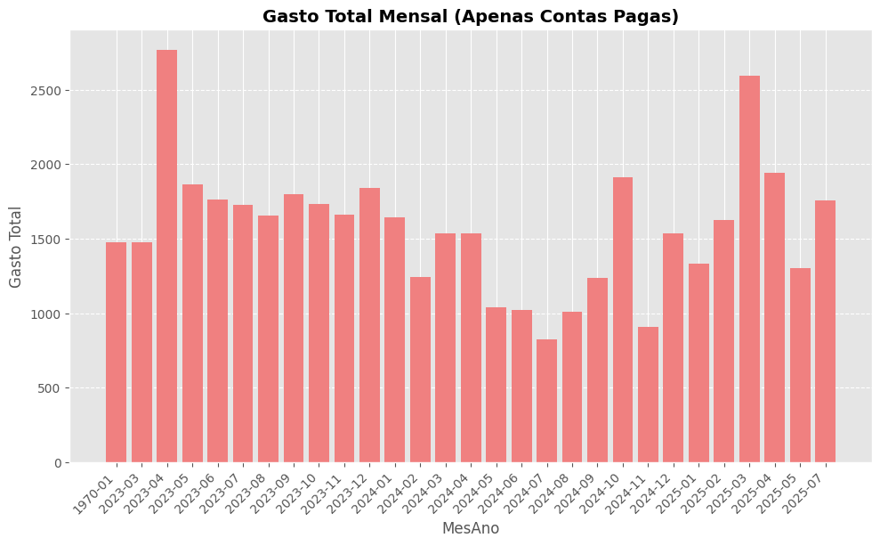

# 📊 Análise de Gastos Pessoais

> Pipeline em **Python 3.11+** para análise e visualização de despesas pessoais, com foco em limpeza de dados, agregação mensal e identificação de maiores gastos.

---

## 🧭 Sumário

- [Descrição](#-descrição)
- [Arquitetura](#-arquitetura)
- [Stack Tecnológica](#-stack-tecnológica)
- [Instalação & Setup](#-instalação--setup)
- [Execução](#-execução)
- [Saída e Resultados](#-saída-e-resultados)
- [Testes](#-testes)
- [Estrutura de Pastas](#-estrutura-de-pastas)
- [Boas Práticas e Qualidade](#-boas-práticas-e-qualidade)
- [Melhorias Futuras](#-melhorias-futuras)
- [Licença](#-licença)

---

## 🧩 Descrição

O script realiza uma **análise exploratória automatizada** de um arquivo Excel (`Contas_Pessoais.xlsx`), gerando:

- Limpeza e padronização dos dados de despesas.
- Cálculo dos **gastos totais por mês**.
- Identificação dos **itens mais caros (Top 20)**.
- Geração automática de gráficos em `.png` dentro da pasta `image/`.

⚙️ Ideal para:
- Controle de finanças pessoais.
- Dashboards financeiros simples.
- Pipelines automatizados de relatórios agendados (via cron, GitHub Actions, CI/CD etc).

---

## 🧱 Arquitetura

📁 despesas_pessoais/
│
├── analise_gasto.py # Script principal (entrypoint)
├── despesas/ # Módulos especializados (futuro refactor)
│ ├── limpeza.py
│ ├── analise.py
│ └── grafico.py
│
├── image/ # Saída de gráficos (auto-criada)
├── Contas_Pessoais.xlsx # Base de dados de entrada
├── requirements.txt
└── README.md

---

## 🧰 Stack Tecnológica

| Componente | Versão mínima | Finalidade |
|-------------|----------------|-------------|
| Python | ≥ 3.11 | Linguagem principal |
| Pandas | ≥ 2.1 | Manipulação de dados |
| NumPy | ≥ 1.26 | Suporte numérico |
| Matplotlib | ≥ 3.8 | Geração de gráficos |
| OpenPyXL | ≥ 3.1 | Leitura de arquivos Excel |

---

## ⚙️ Instalação & Setup

Clone o repositório e crie um ambiente virtual isolado:

```bash
git clone https://github.com/GeovaneParedes/despesas_pessoais.git
cd despesas_pessoais

python -m venv env
source env/bin/activate  # Linux / macOS
# .\env\Scripts\activate  # Windows

pip install -r requirements.txt

📦 requirements.txt sugerido

pandas>=2.1
numpy>=1.26
matplotlib>=3.8
openpyxl>=3.1

🚀 Execução

Para rodar a análise:

python analise_gasto.py

Argumentos de entrada

O script espera o arquivo:

Contas_Pessoais.xlsx

com as seguintes colunas obrigatórias:

| Coluna           | Tipo      | Exemplo           |
| ---------------- | --------- | ----------------- |
| `Contas a Pagar` | string    | "Aluguel Casinha" |
| `Valor`          | float/int | 1350.00           |
| `Pagamento`      | data      | "2023-04-15"      |
| `Status`         | string    | "Pago"            |

📈 Saída e Resultados

Após a execução:

🧮 Resumo no terminal

--- Análise Concluída ---
O mês com o maior gasto total foi: 2023-04
O item com o maior gasto acumulado foi: Aluguel Casinha
Gráficos salvos na pasta 'image/'.

🖼️ Gráficos gerados

image/
├── gastos_mensais_totais.png
└── top_20_contas_mais_caras.png




🧪 Testes

Estrutura básica de testes com pytest:

pytest -v

Exemplo (tests/test_limpeza.py):
from despesas.analise import limpar_dados
import pandas as pd

def test_limpeza_remove_valores_invalidos():
    df = pd.DataFrame({
        "Contas a Pagar": ["Conta X"],
        "Valor": ["abc"],
        "Pagamento": ["2024-01-01"],
        "Status": ["Pago"]
    })
    result = limpar_dados(df)
    assert result.empty


🧹 Boas Práticas e Qualidade

Código compatível com PEP8 / PEP484 (type hints).

Modularização orientada a Clean Code e SOLID.

Tratamento robusto de exceções (try/except).

Logging e asserts de integridade em pontos críticos.

Compatível com pipelines de CI/CD e execução agendada.

🔮 Melhorias Futuras

Refatorar em pacote despesas/ com módulos e logging centralizado.
Adicionar relatório automático em PDF com gráficos e resumo.
Criar CLI com argparse para seleção de arquivo e top_n.
Integração com Google Sheets ou Notion API.
Deploy via Docker para execução em cron job.

📜 Licença

Este projeto é distribuído sob a licença MIT.
Sinta-se livre para utilizar, modificar e contribuir.

🧠 Autor

@DevGege
💼 Programador Sênior — Python | DevOps | DataOps

### 📬 Conecte-se comigo
[Contato Profissional](https://t.me/DevGege)

[LinkedIn](https://is.gd/KiDqk4)

[GitHub](https://github.com/GeovaneParedes)


"Código limpo é aquele que não precisa de explicação." — Robert C. Martin
